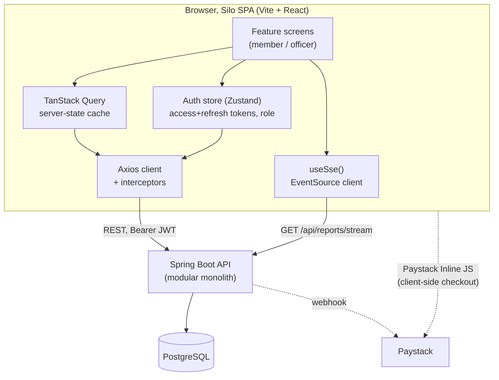

# Silo, Frontend Architecture & Design Document

Companion to `docs/silo-technical-documentation.docx`. Where that document
specifies the backend's modules, entities, events, and endpoints, this one
specifies the frontend that consumes them: what it's built with, how it's
structured, every screen it needs, and how it stays correct against an
event-driven, double-entry-ledger backend where money is involved.

> **Status (2026-08-16):** Phase 1 (§16) is implemented and verified against
> the real backend's live `/v3/api-docs`, not just this planning doc. Where
> the two disagreed, the sections below have been corrected to match reality
> and the discrepancy is called out inline. The single biggest gap: the
> backend still has no list/detail GET endpoints for members, loan requests,
> or loans (§14 #4), those screens run on MSW-mocked seed data until the
> backend adds them. See [`docs/deployment.md`](deployment.md) for exactly
> what's real vs. mocked today and how to run this against a live backend.

---

## 1. Scope & framing

Silo has two audiences with very different jobs to do against the same
data:

- **Member**, joins, gets KYC-verified, contributes to the fund, applies
  for loans, guarantees other members' loans, repays.
- **Officer**, verifies KYC, approves/rejects loan requests and
  guarantors, watches the ledger and the live dashboard, handles defaults.

There is no anonymous/public browsing beyond login and self-registration.
This is an authenticated internal tool, not a marketing site, so the
frontend is built as a single-page application, not a server-rendered
public site. No SEO requirement, no anonymous content to pre-render.

---

## 2. Tech stack

| Concern | Choice | Why |
|---|---|---|
| Build tool | **Vite** | Confirmed by team decision. Fast dev server, native ESM, first-class React + TS template. |
| Framework | **React 19 + TypeScript** (`strict`) | SPA behind auth; matches the team's existing JS/TS familiarity; huge ecosystem for the forms/tables/charts this app is mostly made of. React 19 rather than 18, the version available when the project was actually scaffolded. |
| Routing | **React Router v6** | Nested routes map cleanly onto the role-based layout split (member shell vs officer shell). |
| Server state | **TanStack Query** | The backend is REST + SSE, not GraphQL, Query gives caching, retry, background refetch, and cache invalidation without hand-rolling it. Every "list of X" and "X detail" screen is a query; every form submit is a mutation that invalidates the right query keys. |
| Client/session state | **Zustand** (small, scoped stores) | Only real client-only state is auth/session and UI state (modals, filters). Avoid Redux ceremony for a state surface this small. |
| Forms | **React Hook Form + Zod** | Loan requests, contributions, KYC review, repayments are all forms with real validation rules (positive amounts, required guarantors, etc.), Zod schemas double as the single source of truth for validation and TS types, and mirror the backend's Bean Validation rules (T3) so errors are caught before a round trip. |
| HTTP client | **Axios**, one instance in `shared/api/client.ts` | Interceptors attach the access token, normalize the backend's error shape into one FE-side `ApiError`, transparently unwrap the `{success, message, data, timestamp}` envelope every real response is wrapped in, and refresh-then-retry once on an unauthenticated response before logging out. |
| Real-time | **native `EventSource`**, wrapped in `useSse()` | Talks to `GET /api/reports/stream`, confirmed to exist on the real backend. The hook is built but not yet wired into the dashboard, Phase 1 ships polling instead (§16); activating SSE is a fast-follow, not a rebuild. |
| Styling | **Tailwind CSS v4 + hand-built Radix primitives** | Accessible unstyled primitives (dialog, dropdown, tabs, select) with Tailwind for the visual layer, following shadcn/ui's conventions without pulling from its CLI registry. Tailwind v4 resolved as latest at build time, class-based dark mode via `@custom-variant`, no `tailwind.config.js` needed. |
| Charts | **Recharts** | Dashboard needs trend lines (contributions over time) and simple bar/donut breakdowns (default rate, top contributors), Recharts covers both without D3-level complexity. |
| API types | **Hand-maintained**, verified line-by-line against the backend's live `/v3/api-docs` | `openapi-typescript` . Types in `shared/types/*` were written by hand against the design doc, then corrected against the real OpenAPI spec after integration to the backend, see §14 for what changed. |
| Testing | **Vitest + React Testing Library** (unit/component), **Playwright** (e2e), **MSW** (gap-fill only, see §14 #4) | Same pattern as the backend's own test pyramid (T49): unit-level logic, integration-level flows, and a thin layer of true e2e golden paths. MSW's role narrowed from "mock everything" to "fill the handful of endpoints the real backend doesn't expose yet"; e2e specs stub the real endpoints they touch directly via Playwright's `page.route()`, or seed an authenticated `sessionStorage` session directly when a test doesn't need to exercise login itself (see §15, the preview server was assumed to have no dev-time proxy to the backend, but empirically it does; see the callout in §15). |
| Lint/format | **ESLint + Prettier + TypeScript `strict`** | Non-negotiable on a project where a `number | undefined` slipping through a balance calculation is a real bug, not a lint nit. |

**Not chosen, deliberately:** Next.js (no SSR/SEO need, would add a
server runtime for no benefit), Redux/Redux Toolkit (state surface is too
small to justify it), GraphQL (backend is REST/SSE).

**Version note:** `@tanstack/react-table` resolved to a v9 pre-release at
install time with an incompatible, largely-rewritten API; pinned to the
latest stable v8 instead, which is what `DataTable`'s sort/filter/pagination
implementation actually targets.

---

## 3. High-level architecture



Two things worth calling out because they shape the frontend directly:

- **The SSE stream is scoped to the reporting dashboard only** (`GET
  /api/reports/stream`), not a general "any entity changed" firehose. A
  member's own loan-detail page does **not** get pushed updates when an
  officer approves it elsewhere, it refetches on focus/interval like any
  other REST-backed screen (TanStack Query's `refetchOnWindowFocus` +
  a short `staleTime` on statuses that change often, e.g. loan/KYC status).
  Only the two dashboard screens (`/admin/dashboard` for officers,
  a lighter member-facing summary) subscribe to SSE.
- **Paystack contributions are a two-hop flow.** The backend only exposes
  a webhook *receiver* (`POST /api/webhooks/paystack`), there is no
  "initiate payment" endpoint, because Paystack checkout is a client-side
  concern. The frontend opens Paystack's Inline JS popup directly with the
  public key; Paystack notifies the backend asynchronously via webhook.
  This means the frontend cannot show "contribution recorded" the instant
  the popup closes, see §12.2 for the UX pattern this requires.
- **The backend sends no CORS headers.** Confirmed by testing a preflight
  request directly, there's no `Access-Control-Allow-Origin` on any
  response. Local dev routes `/api/*` through Vite's dev-server proxy
  (`vite.config.ts`) instead of asking the backend for a CORS allowlist,
  so the browser only ever sees same-origin requests. Production needs the
  equivalent: either a reverse proxy putting both under one origin, or a
  real backend CORS change, see `docs/deployment.md`.

---

## 4. Route map

Two role-scoped shells sharing the same auth/layout chrome, gated by a
`RoleGuard` reading the role the login response returns directly (see §7,
there's no JWT decoding involved).

Endpoints below are corrected against the backend's live `/v3/api-docs`.
*(gap)* means no such endpoint exists on the real backend at all, MSW
fills it with seed data (`tests/mocks/handlers/gaps.ts`) and the screen
shows a visible banner saying so. Everything else hits the real API.

### Public

| Route | Purpose |
|---|---|
| `/login` | `POST /api/auth/login` → `{ accessToken, refreshToken, memberId, role }` directly, no JWT decoding needed |
| `/register` | **Two calls**, not one: `POST /api/members` creates the profile (`kycStatus` starts `PENDING`), then `POST /api/auth/register` sets the login password against the returned `memberId` |

### Member (`role: MEMBER`)

| Route | Purpose | Primary endpoint(s) |
|---|---|---|
| `/dashboard` | Personal summary: total contributed, active loan count, total repaid, outstanding balance | `GET /api/reports/members/{id}/summary` (one call, not three), `GET /api/loans?mine=true` *(gap)* for the outstanding-balance link |
| `/profile` | View/edit profile, KYC status badge, ID fields | `GET/PUT /api/members/{id}`. No file upload, `idType`/`idNumber`/`idDocumentRef` are plain strings on the profile-update body, not a multipart endpoint (§14 #3) |
| `/contributions` | History + running total, "Contribute via Paystack" CTA | `GET /api/contributions/member/{id}`, `.../summary`. Contributions have no `status` field, a row only exists once confirmed, so presence of a matching `reference` *is* confirmation |
| `/loans` | My loan requests & loans, any status | `GET /api/loan-requests?mine=true` *(gap)*, `GET /api/loans?mine=true` *(gap)* |
| `/loans/apply` | New loan request form (amount + purpose only) | `POST /api/loan-requests`. Member does **not** choose a term, the officer sets `interestRate`/`durationMonths` at approval time |
| `/loans/:id` | Schedule, outstanding balance, guarantors, status | `GET /api/loans/{id}` (real, but has no `guarantors` field); guarantors are read via the request's gap-filled detail through `loanRequestId`, or `GET /api/loan-requests/:id` *(gap)* directly for a still-pending request |
| `/loans/:id/guarantors/add` | Add a guarantor to a pending request | `GET /api/members/available-guarantors` (returns `email` + `credibilityScore`, not a name), `POST /api/loan-requests/{id}/guarantors` |
| `/loans/:id/repay` | Make a repayment | `POST /api/repayments`, requires a `reference` string, not just an amount. Overpayment is a hard 422, not capped server-side, so the amount field pre-fills and caps (`max` attribute + Zod `.max()`) at the loan's current `outstandingBalance` to avoid a guaranteed-fail round trip; the form sets `noValidate` so the app's own error styling shows instead of a native browser validation popup |
| `/guarantor-invites` | Pending invites, with the borrower's risk tier, accept/decline | `GET /api/members/{id}/guarantor-invites` (already pre-filtered to pending; returns `borrowerRiskTier: LOW\|MEDIUM\|HIGH`, not a numeric score, and no borrower name, just `borrowerMemberId`), `POST /api/guarantors/{id}/accept\|decline` |
| `/guarantor-liabilities` | Liabilities assigned after a default I guaranteed, pay down | Still Phase 2/unbuilt (§16), and unlike the other gaps, there's no GET endpoint to even gap-fill; only `POST /api/repayments/liability` exists |
| `/notifications` | Email delivery history, not an in-app inbox | `GET /api/notifications/member/{memberId}` → `eventType`/`channel`/`status: SENT\|FAILED`/`sentAt`. No `title`, `message`, or `read` field exists, see §14 |

### Officer (`role: OFFICER`), superset, own shell

| Route | Purpose | Primary endpoint(s) |
|---|---|---|
| `/admin/dashboard` | Org metrics: active loans, total contributions, outstanding balance, default rate | `GET /api/reports/dashboard` (polled every 15s in Phase 1, not SSE, see §8). `top-contributors` confirmed to exist but not wired into this screen yet |
| `/admin/members` | Member list/search, KYC queue | `GET /api/members` *(gap)* |
| `/admin/members/:id` | Detail, KYC approve/reject, status change | `PATCH /api/members/{id}/status` (`ACTIVE\|INACTIVE\|SUSPENDED`, not the `PENDING`/`CLOSED` this doc originally assumed), `PATCH /api/members/{id}/kyc` |
| `/admin/loan-requests` | Pending-approval queue | `GET /api/loan-requests?status=PENDING` *(gap)*. No risk/credibility panel data available for an arbitrary member, see §14 #9 |
| `/admin/loan-requests/:id` | Approve/reject decision screen | `POST /api/loan-requests/{id}/approve` (requires `{ interestRate, durationMonths }` in the body, this is where loan terms actually get set), `POST /api/loan-requests/{id}/reject` (no body, no reason field accepted) |
| `/admin/loans` | All loans, filterable by status (incl. `DEFAULTED`) | `GET /api/loans` *(gap)* |
| `/admin/loans/:id` | Full detail; guarantor liabilities after default still Phase 2 | `GET /api/loans/{id}` (real; no guarantors embedded, same workaround as the member `/loans/:id` view) |
| `/admin/contributions` | Record a manual contribution, browse all | `POST /api/contributions` (officer-only per the backend's own doc comment; requires `reference`, no `source`/`method` field, the backend sets that), `GET /api/contributions` for "browse all" *(gap, found during backend integration, not in the original list)* |
| `/admin/ledger` | Account balances, trial balance | `GET /api/ledger/accounts/{id}/balance`, `GET /api/ledger/trial-balance`, confirmed to exist, still unbuilt (Phase 2) |
| `/admin/reports` | Reporting endpoints, exportable views | `GET /api/reports/top-contributors` confirmed to exist, still unbuilt (Phase 2) |

Shared: `/403` (role mismatch), `/404`, a global error boundary screen.

---

## 5. Application structure

Frontend feature folders mirror the backend's module boundaries
(`member`, `contribution`, `loan`, `repayment`, `accounting`, `reporting`,
`notification`, `paymentgateway`, `auth`) one-to-one. Same reasoning the
backend doc gives for its own modularity applies here: a feature owns its
API calls, types, hooks, and screens, and cross-feature reuse goes through
`shared/`, not by reaching into another feature's internals.

The tree below is scaffolded at the **repo root**, as this repo *is* the frontend.

```
├── src/
│   ├── app/
│   │   ├── providers/        # QueryProvider, ThemeProvider, all implemented
│   │   ├── router.tsx        # RoleGuard-wrapped route tree
│   │   └── App.tsx
│   ├── features/
│   │   ├── auth/
│   │   │   ├── api.ts        # login(), register() (two real calls, see §4/§9.1)
│   │   │   ├── store.ts      # Zustand: accessToken, refreshToken, role, memberId
│   │   │   ├── hooks.ts      # useAuth(), useRequireRole()
│   │   │   └── components/   # LoginForm, RoleGuard, AuthGuard
│   │   ├── member/            # profile, KYC, admin member list/detail
│   │   ├── contribution/      # history, summary, manual-entry (officer), Paystack CTA
│   │   ├── loan/              # requests, guarantors, schedule, approvals
│   │   ├── repayment/         # borrower repayment + guarantor liability repayment forms
│   │   ├── reporting/         # dashboard, member summary, useSse() (built, not yet activated)
│   │   ├── notification/      # email delivery history (see §4, §14)
│   │   └── paymentgateway/    # Paystack Inline JS wrapper (client-side only, no backend calls)
│   ├── shared/
│   │   ├── api/               # axios instance, interceptors, envelope unwrap, error normalizer
│   │   ├── components/        # Button, DataTable, Card, StatusBadge, EmptyState, ErrorState, Skeletons, ThemeToggle
│   │   ├── hooks/              # useSse(), usePagination(), useDebounce()
│   │   ├── lib/                # currency/date formatters, Zod schema helpers
│   │   └── types/              # hand-maintained, verified against the real OpenAPI spec (see §2)
│   └── main.tsx
├── tests/
│   ├── e2e/                    # Playwright golden paths, stub real endpoints via page.route()
│   └── mocks/
│       ├── db.ts               # seed fixtures for the gap-fill handlers only
│       └── handlers/gaps.ts    # the handful of endpoints the real backend doesn't expose yet
└── vite.config.ts              # includes the dev-server proxy to the backend (§3)
```

An `accounting/` feature was planned for the ledger/trial-balance screens
but hasn't been split out yet, those routes are still Phase 2 placeholders
(§16), so there's nothing there to own yet.

Each `features/*` folder follows the same internal shape: `api.ts` →
`hooks.ts` (Query/mutation wrappers) → `components/` (dumb, presentational)
→ `screens/` (route-level, composes hooks + components).

---

## 6. State management strategy

Three kinds of state, three different tools, deliberately not one
framework for everything:

1. **Server state** (anything that lives in Postgres): TanStack Query.
   Query keys are structured per-resource so mutations invalidate
   precisely, e.g. approving a loan request invalidates
   `['loan-requests', 'pending']` and `['loans', loanId]`, not the whole
   cache.
2. **Session/auth state**: a small Zustand store holding the access token,
   refresh token, role, and member id exactly as the login response
   returns them, no JWT decoding involved (§7). Axios's request
   interceptor reads the access token from it; the response interceptor
   attempts one silent refresh on an unauthenticated response before
   clearing the session and redirecting to `/login` (§7).
3. **Ephemeral UI state** (open modal, active table filter, wizard step
   in the loan-application form): local component state or a
   per-feature Zustand slice. Never put this in Query cache or URL unless
   it should survive a refresh (filters/pagination *should* live in URL
   search params, so a shared link reproduces the same view).

**Money is never optimistic.** Contribution, repayment, and approval
mutations show a pending/spinner state and wait for the server response
before updating the UI, no optimistic cache writes on financial actions.
The backend's transactional-outbox reliability guarantee (nothing is lost
between commit and delivery) is worth nothing if the frontend shows a
success state before the server has confirmed it.

---

## 7. Auth & RBAC

- Login posts to `/api/auth/login` and gets `{ accessToken, refreshToken,
  memberId, role }` back directly in the response body, **no JWT
  decoding happens anywhere in the frontend**. This was originally
  planned as a decode-the-role-claim design (§14 #2 flagged the
  uncertainty); the real backend resolved it more simply by just
  returning role and member id alongside the tokens. `RoleGuard` reads
  `role` straight from the auth store for UI gating only, **the frontend
  gate is cosmetic**; the backend's authorization checks are the actual
  boundary. Every officer screen still calls real officer-only endpoints
  and gets a real `403` from the backend if the role were ever tampered
  with client-side.
- Token storage: in-memory (Zustand, not persisted) plus a short-lived
  `sessionStorage` mirror so a page refresh doesn't force re-login within
  the same tab.
- `POST /api/auth/refresh` (confirmed to exist, and implemented): on any
  response that looks unauthenticated, the Axios interceptor exchanges
  the stored refresh token for a new access+refresh pair and retries the
  original request once before giving up. Concurrent requests that 401 at
  the same time share a single in-flight refresh call rather than each
  triggering their own.
- **"Unauthenticated" isn't just `401`.** Empirically, a missing or
  invalid token returns `403` with an **empty body**, while a valid token
  hitting the wrong role returns `403` with a real JSON error body (same
  shape as any other validation error). The interceptor distinguishes
  them by checking whether the response body is present: empty → treat as
  unauthenticated (refresh, then log out if that fails too); populated →
  a genuine permission error, surfaced to the screen as-is, session left
  alone.
- `RoleGuard` wraps the officer route subtree; a MEMBER hitting an
  `/admin/*` route client-side-navigates to `/403` before a request is
  even made. A separate `AuthGuard` (not originally planned) wraps the
  member route subtree the same way, since without it an unauthenticated
  visitor could land on a member screen directly and only get bounced
  once a query failed.
- **Officer self-action exclusion is enforced client-side too, not just
  server-side.** The backend rejects an officer approving/rejecting their
  own loan request, recording their own contribution, or changing their
  own KYC/status with a 422, an officer is a member first, so this can't
  be role-gated away. The UI mirrors that rather than letting a form fail
  predictably: `/admin/loan-requests` filters the logged-in officer's own
  pending request out of the approval queue (and the detail screen
  disables Approve/Reject with an explanation if reached directly by
  URL); the manual-contribution member picker on `/admin/contributions`
  excludes the officer; `/admin/members` excludes the officer from the
  list, and `/admin/members/:id` disables the KYC/status controls if the
  officer is viewing their own profile. Same principle as role gating
  above, cosmetic/UX, the backend's 422 is the real boundary.

---

## 8. Real-time dashboard (SSE)

**Status: built, not activated.** `GET /api/reports/stream` is confirmed
to exist on the real backend, and the hook below is implemented in
`shared/hooks/useSse.ts`, but `/admin/dashboard` uses TanStack Query
polling (`refetchInterval`, 15s) for Phase 1 rather than this hook, per
§16's "polled, SSE as a fast-follow." Wiring it in is expected to be a
small change (swap the polling query for the SSE subscription below), not
a redesign.

`useSse(url)` wraps `EventSource`, exposing `{ data, status }` where
`status` is `connecting | open | error`. On `error` it backs off
(1s → 2s → 5s → 10s, capped) and retries, `EventSource` auto-reconnects
natively, but the hook adds a visible "reconnecting…" state in the UI
instead of silently failing, and a manual "refresh" fallback that hits
`GET /api/reports/dashboard` directly if the stream stays down.

Each SSE message updates the relevant TanStack Query cache entry directly
(`queryClient.setQueryData`) rather than triggering a full refetch, the
backend is already pushing the new projection state, so re-fetching it
would be redundant.

---

## 9. Key user flows

### 9.1 Registration → KYC → first contribution
1. `/register` → **two real calls**: `POST /api/members` creates the
   profile (`kycStatus` starts `PENDING`, `status` is `ACTIVE`
   immediately, there's no `PENDING` account-status state), then
   `POST /api/auth/register` sets a login password against the returned
   member id. Only after both succeed does the UI send the member to
   `/login`.
2. Member fills in `idType`/`idNumber`/`idDocumentRef` as plain text
   fields on `/profile` via `PUT /api/members/{id}`, there is still no
   file-upload endpoint (§14 #3), so "uploading" a document today means
   pasting in a reference to wherever it's actually hosted.
3. Officer reviews on `/admin/members/:id`, approves via `PATCH
   .../kyc`.
4. Member's `/profile` KYC badge flips to `VERIFIED` on next fetch
   (poll or refetch-on-focus, not SSE-covered, see §3).
5. Member can now see the "Contribute" CTA enabled on `/contributions`
   (gated client-side on `status === ACTIVE && kycStatus === VERIFIED`,
   re-validated server-side regardless).

### 9.2 Contribution via Paystack
1. Member clicks "Contribute", enters amount, frontend opens Paystack
   Inline JS popup directly (no backend call yet).
2. On Paystack success callback, frontend shows a **"Confirming…"**
   pending state (not "success", the ledger posting hasn't happened
   yet) and starts polling `GET /api/contributions/member/{id}` every
   few seconds, checking for a row whose `reference` matches the
   Paystack transaction reference.
3. Paystack's webhook lands on the backend, `ContributionMadeEvent`
   fires, Accounting posts the journal entry. **A contribution row only
   ever exists once confirmed**, there's no `status` field on
   `ContributionResponse` to check, unlike the original plan assumed;
   the row's mere presence with the matching reference *is* the
   confirmation signal.
4. Poll picks up the new contribution row → UI flips to "Confirmed",
   stops polling. A visible timeout (~60s) falls back to "We'll notify
   you" messaging plus reliance on the Notification module's email,
   rather than polling forever.

### 9.3 Loan application → guarantor → approval → disbursement
1. `/loans/apply` → `POST /api/loan-requests` with `{ amountRequested,
   purpose }` only. **The member does not choose a term or rate**, that
   was the original plan, but the real `LoanRequestSubmitRequest` has no
   such fields; interest rate and duration are officer-set, at approval.
   Same gate as the Contribute CTA in §9.1: "Apply for a loan" on `/loans`
   is disabled (with a visible reason, not just a hover tooltip, disabled
   buttons don't reliably fire `title` tooltips cross-browser) unless the
   member's own profile shows `status === ACTIVE && kycStatus ===
   VERIFIED`, and `/loans/apply` repeats the check if reached directly.
2. `/loans/:id/guarantors/add` → pick from `available-guarantors` (shows
   each candidate's `email` and `credibilityScore`, there's no member
   name on this response) → `POST .../guarantors`.
3. Invited guarantor sees it on their own `/guarantor-invites`, the
   response carries `borrowerRiskTier` (`LOW`/`MEDIUM`/`HIGH`), not a
   numeric risk score as originally planned, and no borrower name, just
   `borrowerMemberId`, and accepts/declines. Guarantor status values are
   `PENDING`/`ACCEPTED`/`DECLINED`, not `INVITED`/`ACCEPTED`/`DECLINED`.
4. Once ≥1 `ACCEPTED` guarantor, request appears in officer's
   `/admin/loan-requests` queue *(gap-filled, see §4)*. There's no
   numeric credibility score for an arbitrary member to show the
   officer (§14 #9), the decision screen surfaces KYC status and
   accepted-guarantor count instead of the originally-planned
   risk/credibility panel.
5. Approve → `POST .../approve` with `{ interestRate, durationMonths }`
   in the body, this is the officer setting the terms the member never
   chose in step 1. `Loan` + installment schedule created server-side.
   Member's `/loans/:id` now shows the schedule. Rejecting takes no body
   at all, there's no rejection-reason field.

### 9.4 Default → guarantor liability
Unchanged from the original plan and still entirely unbuilt (Phase 2,
§16), the backend has no GET endpoint for guarantor liabilities at all,
only `POST /api/repayments/liability` to pay one down once it exists.
1. Scheduled sweep marks installments `LATE`, eventually `DEFAULTED`,
   entirely server-side, no frontend trigger.
2. Affected guarantors would see a new entry on `/guarantor-liabilities`
   once a read endpoint exists (this *does* warrant a Notification-module
   email, which the frontend links to from `/notifications`).
3. Guarantor pays down via `POST /api/repayments/liability`, same
   pending-confirmation pattern as §9.2 (no optimistic success).

---

## 10. Design system

- **Palette**: a trust-oriented base (deep navy/indigo primary) with a
  strict semantic mapping for status, this app is full of status badges
  (`PENDING`/`VERIFIED`/`REJECTED`, `ACTIVE`/`CLOSED`/`DEFAULTED`,
  `PAID`/`LATE`/`DEFAULTED`) and consistent color meaning matters more
  than aesthetic variety: green = paid/verified/accepted, amber =
  pending/late, red = defaulted/rejected/declined, slate = closed/neutral.
- **Typography**: one readable UI sans-serif (e.g. Inter), tabular
  figures (`font-variant-numeric: tabular-nums`) for every money and
  date column so tables of amounts stay visually aligned.
- **Layout**: mobile-first for the member shell (contributions/loan
  status are things people check on their phone); the officer shell can
  assume a desktop-first data-table-heavy layout since approvals and the
  ledger are desk work.
- **Core components** (`shared/components/`): `DataTable` (sort, filter,
  pagination, used by every list screen), `StatusBadge` (semantic
  color mapping above), `Money` (currency formatter, right-aligned,
  tabular), `EmptyState`, `ErrorState`, `FilterPill` (the active/inactive
  toggle used by every status-filter row, e.g. `/admin/members`,
  `/admin/loans`), skeleton loaders per card/table shape so nothing pops
  in unstyled.
- **Dark mode** (pulled forward from the Phase 3 stretch list in §16,
  implemented, not deferred): a `ThemeToggle` cycles
  system → light → dark → system, backed by a Zustand store persisted to
  `localStorage` (a real user preference, unlike session state, so it
  intentionally survives across sessions, not just the tab). Tailwind v4's
  class-based `dark:` variant handles the styling; every shared component
  and screen carries the semantic mapping above in both palettes.
- **Accessibility**: WCAG AA contrast, all interactive elements
  keyboard-reachable (Radix primitives give this for free), form errors
  announced via `aria-live`, no color-only status signaling (badges pair
  color with a text label, never color alone).

---

## 11. Error handling & resilience UX

- Backend's `@ControllerAdvice` gives one consistent error shape,
  confirmed by testing: `{ timestamp, status, error, message, path,
  errors: [{ field, message }] }`. The Axios interceptor normalizes it
  (plus the unauthenticated-empty-403 case from §7) into a single FE
  `ApiError` type so every screen handles errors the same way, no
  per-screen guessing at response shape. Successful responses get the
  same treatment in reverse: every real endpoint wraps its payload in
  `{ success, message, data, timestamp }`, and the interceptor unwraps
  it transparently so the rest of the codebase never touches the
  envelope directly.
- Field-level errors map onto React Hook Form's error state directly;
  non-field errors (e.g. "guarantor must have ACTIVE status") render as
  a form-level alert, not a toast that disappears before it's read.
- Every submit button disables for the duration of the request, no
  double-submit races on financial mutations (idempotency is a backend
  concern too, but the frontend shouldn't make it easy to trigger
  duplicates).
- Network/5xx errors get a retry affordance, not a dead end.

---

## 12. Security considerations (frontend-side)

- No secrets in the bundle beyond the Paystack **public** key (by
  design, publishable).
- All rendered user-generated text (member names, loan purposes) is
  React's default-escaped JSX, no `dangerouslySetInnerHTML` anywhere
  near member input.
- KYC documents: the original plan called for client-side file-type/size
  validation ahead of a multipart upload. There is no upload endpoint on
  the real backend (§14 #3), `idDocumentRef` is a plain string field, so
  this validation concern doesn't currently apply; revisit if/when a real
  upload endpoint appears.
- Role gating in the router is UX, not security, reiterated from §7
  because it's the one design decision most likely to be
  misunderstood by a new contributor.

---

## 13. Performance

- Route-based code splitting via React Router's lazy route modules,
  the officer bundle (ledger, admin tables, approval workflows) is not
  shipped to members who will never hit `/admin/*`.
- TanStack Query's cache + `staleTime` tuning avoids redundant refetches
  on tab-switch for data that doesn't change often (member profile) vs.
  short `staleTime` for data that does (loan/KYC status, pending queues).
- Recharts components lazy-loaded on the dashboard route only.

---

## 14. Backend integration findings

These started as open questions raised before any backend existed to ask.
The backend is now live and its `/v3/api-docs` was read directly (plus
empirical testing, real requests, real error responses) on 2026-08-16.
Below is what that resolved, what's still genuinely missing, and what
turned up that nobody had thought to ask about yet.

### Resolved

1. **Token refresh** *(was open question #3)*, resolved. `POST
   /api/auth/refresh` exists, rotates the refresh token, and is wired
   into the Axios client (§7).
2. **Member "role" field** *(was open question #5)*, resolved, but not
   where originally guessed. Role lives on the login response
   (`LoginResponse.role`) only, `MemberResponse` has no role field at
   all. There's no client-side JWT decoding anywhere as a result (§7).
3. **KYC document upload** *(was open question #2)*, resolved, but not
   how originally assumed. There's no upload endpoint, multipart or
   otherwise. `idType`/`idNumber`/`idDocumentRef` are plain strings on
   `MemberProfileUpdateRequest` (`PUT /api/members/{id}`), the frontend
   never handles a file, just a reference string to wherever the document
   actually lives. If a real upload flow is ever wanted, it needs a new
   endpoint.

### Still open

4. **List endpoints.** *(was open question #1, confirmed, not just
   undocumented.)* `GET /api/members/{id}` and `GET /api/loans/{id}`
   exist; there is still no `GET /api/members`, `GET /api/loans`, or any
   GET for loan requests at all (list *or* single) on the real backend.
   Also newly confirmed missing: `GET /api/contributions` (browse-all for
   officers) and any endpoint that returns a loan request's guarantors.
   All of it is gap-filled by MSW today (`tests/mocks/handlers/gaps.ts`,
   visible amber banners on the affected screens), genuinely
   disconnected from the real database, so a request submitted for real
   won't show up in the mocked queue. This is the actual priority ask for
   the backend team; everything else in this section is informational.
5. **Password reset.** Still not documented or implemented, still
   likely needed before this ships to real members.

### New findings

6. **Response envelope.** Every real response wraps its payload:
   `{ success, message, data, timestamp }`. Errors use a different,
   consistent shape: `{ timestamp, status, error, message, path, errors:
   [{ field, message }] }`. Both are handled centrally in
   `shared/api/client.ts` (§11).
7. **No CORS headers.** The backend sends none at all, confirmed via a
   direct preflight request. Local dev works around it with a Vite
   dev-server proxy (§3) rather than requesting a backend change;
   production needs an equivalent (`docs/deployment.md`).
8. **Unauthenticated vs. forbidden are both `403`.** A missing/invalid
   token and a valid-token-wrong-role denial return the same status code
   with different bodies (empty vs. JSON), see §7 for how the frontend
   tells them apart.
9. **No numeric credit score for an arbitrary member.** Only
   `AvailableGuarantorResponse` (guarantor candidates) carries a
   `credibilityScore`; a guarantor invite exposes the borrower's
   `borrowerRiskTier` (`LOW`/`MEDIUM`/`HIGH`) instead of a number. The
   officer's loan-request risk panel (§9.3) had to be redesigned around
   this, no member has a queryable "credit score."
10. **"Notifications" is an email delivery log, not an inbox.**
    `NotificationLogResponse` is `{ id, memberId, eventType, channel,
    status: SENT|FAILED, sentAt }`, no `title`, `message`, or `read`
    field. There is no in-app read/unread concept at the API level at
    all; the `/notifications` screen (§4) was reframed around what this
    endpoint actually is.
11. **Loan installments track status, not partial payments.**
    `LoanInstallmentResponse` has `expectedAmount`, `status`
    (`PENDING`/`PAID`/`LATE`/`DEFAULTED`), and `paidDate`, no running
    "amount paid so far" field, unlike the original schedule design
    assumed.
12. **Member account status has three values, not four.** `ACTIVE` /
    `INACTIVE` / `SUSPENDED`, no `PENDING` or `CLOSED` as originally
    modeled. A brand-new member's `status` is `ACTIVE` immediately;
    `kycStatus` is the field that starts `PENDING`.

None of this blocked the build, Phase 1 (§16) is implemented end-to-end
against the real backend, with the gaps above stubbed behind MSW exactly
as originally planned for the unknowns.

---

## 15. Testing strategy

Mirrors the backend's own layering (T49). **Delivered so far is a basic
setup establishing the pattern, not full coverage**, a handful of
representative tests per layer, not the exhaustive list below:

- **Unit**: Zod schemas, formatters, pure hooks logic (Vitest).
- **Component**: forms and status displays in isolation with MSW-mocked
  API responses (React Testing Library).
- **E2E** (Playwright), three specs so far:
  - `register-login.spec.ts`, register → login → land on the member
    dashboard, with the real (non-gap-mocked) endpoints it touches
    stubbed via `page.route()`.
  - `officer-self-exclusion.spec.ts`, an officer never sees their own
    pending loan request in the `/admin/loan-requests` approval queue.
    Seeds an authenticated `sessionStorage` session directly instead of
    driving the login form, since this test only cares about the
    MSW-gap-filled `/api/loan-requests` list, not auth.
  - `repayment-cap.spec.ts`, the repayment amount input is pre-filled
    and capped at the loan's outstanding balance. Same session-seeding
    approach, plus `test.use({ serviceWorkers: 'block' })` since this
    test only touches a real (non-gap) endpoint and doesn't need MSW.
  - The fuller list this section originally scoped (KYC approval →
    contribution; loan request → guarantor → approval → disbursement;
    default-sweep effects) is still just scope, not built yet.

  **Correction to the original assumption:** this section and §2 stated
  the preview server (`npm run preview`, what `test:e2e` builds and
  serves) has no dev-time proxy to the backend, so `page.route()` stubs
  were assumed to be the only thing intercepting a request. That's not
  true empirically, confirmed by `curl`ing the running preview server
  directly (no browser involved): `POST /api/auth/login` on port 4173
  returned a real response from the actual backend on `:8080`, meaning
  `vite preview` in the installed Vite version (8.2.1) does apply the
  `server.proxy` config from `vite.config.ts`, same as `npm run dev`.
  Two consequences worth the team's attention, not yet resolved:
  1. A `page.route()` stub for an endpoint MSW's service worker also
     leaves unhandled can lose the race, MSW's `bypass()` re-fetches
     from *inside* the service worker, and Playwright's page-level route
     interception doesn't reliably see service-worker-initiated
     requests. That's why the two newer specs above sidestep `/auth/login`
     entirely (session-seeding) rather than trying to stub it.
  2. If a real backend happens to be reachable at `VITE_BACKEND_ORIGIN`
     wherever `test:e2e` runs (including CI), tests can silently hit it
     instead of the intended stub. Worth deciding deliberately, e.g.
     pointing `VITE_BACKEND_ORIGIN` at an address that's guaranteed
     unreachable in CI, or setting `preview.proxy = undefined` for the
     e2e build, rather than continuing to assume isolation that isn't
     actually there.

---

## 16. Delivery phasing

**Phase 1 (MVP, matches backend's own MVP scope), implemented.** auth,
member profile/KYC, contributions (manual + Paystack), loan request →
guarantor → approval → schedule, repayments, officer dashboard (polled),
notifications history (reframed as the email delivery log it actually is,
see §14 #10). Built and verified against the real backend, with the
list/detail endpoints it doesn't yet expose gap-filled by MSW (§14 #4).

**Phase 3 item delivered early: dark mode.** Shipped during Phase 1 work
rather than held for the stretch list, see §10.

**Phase 2 (not started)**: live SSE dashboard (the hook is already built,
see §8), ledger/trial-balance views, top contributors, guarantor liability
flows (needs a real backend read endpoint first, not just the default
sweep, §9.4), CSV/export on reporting screens.

**Phase 3 (stretch, remaining)**: in-app (not just email) notifications,
which would need the backend to add a real notifications concept beyond the
delivery log (§14 #10), saved filters, admin bulk actions.
