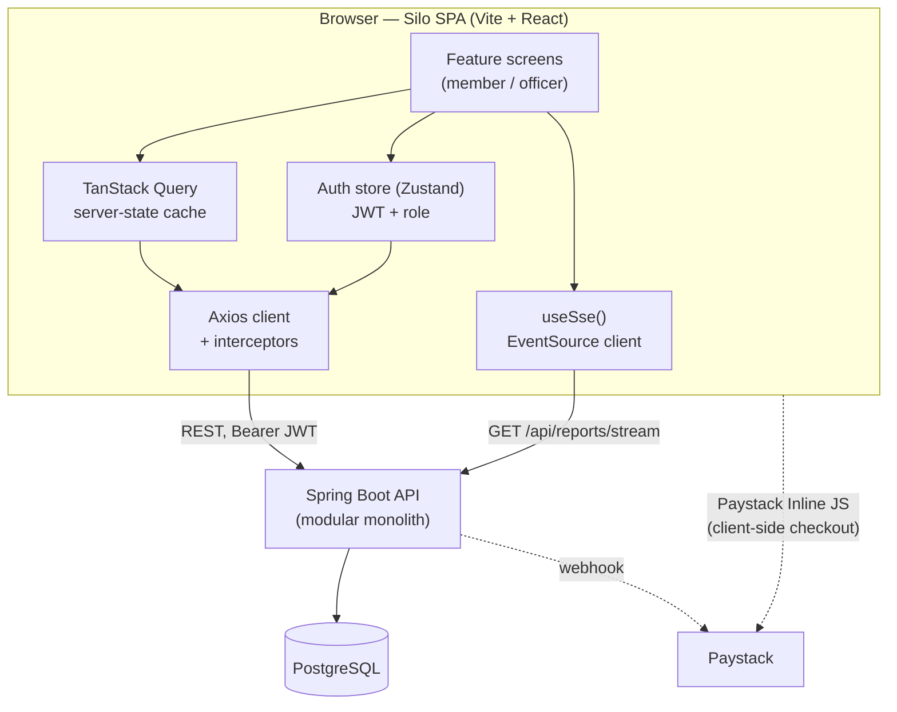

# Silo — Frontend Architecture & Design Document

Companion to `docs/silo-technical-documentation.docx`. Where that document
specifies the backend's modules, entities, events, and endpoints, this one
specifies the frontend that consumes them: what it's built with, how it's
structured, every screen it needs, and how it stays correct against an
event-driven, double-entry-ledger backend where money is involved.

---

## 1. Scope & framing

Silo has two audiences with very different jobs to do against the same
data:

- **Member** — joins, gets KYC-verified, contributes to the fund, applies
  for loans, guarantees other members' loans, repays.
- **Officer** — verifies KYC, approves/rejects loan requests and
  guarantors, watches the ledger and the live dashboard, handles defaults.

There is no anonymous/public browsing beyond login and self-registration.
This is an authenticated internal tool, not a marketing site — so the
frontend is built as a single-page application, not a server-rendered
public site. No SEO requirement, no anonymous content to pre-render.

---

## 2. Tech stack

| Concern | Choice | Why |
|---|---|---|
| Build tool | **Vite** | Confirmed by team decision. Fast dev server, native ESM, first-class React + TS template. |
| Framework | **React 18 + TypeScript** | SPA behind auth; matches the team's existing JS/TS familiarity from a bootcamp cohort; huge ecosystem for the forms/tables/charts this app is mostly made of. |
| Routing | **React Router v6** | Nested routes map cleanly onto the role-based layout split (member shell vs officer shell). |
| Server state | **TanStack Query** | The backend is REST + SSE, not GraphQL — Query gives caching, retry, background refetch, and cache invalidation without hand-rolling it. Every "list of X" and "X detail" screen is a query; every form submit is a mutation that invalidates the right query keys. |
| Client/session state | **Zustand** (small, scoped stores) | Only real client-only state is auth/session and UI state (modals, filters). Avoid Redux ceremony for a state surface this small. |
| Forms | **React Hook Form + Zod** | Loan requests, contributions, KYC review, repayments are all forms with real validation rules (positive amounts, required guarantors, etc.) — Zod schemas double as the single source of truth for validation and TS types, and mirror the backend's Bean Validation rules (T3) so errors are caught before a round trip. |
| HTTP client | **Axios**, one instance in `shared/api/client.ts` | Interceptors attach the JWT, normalize the backend's `@ControllerAdvice` error shape into one FE-side error type, and handle 401 → logout uniformly. |
| Real-time | **native `EventSource`**, wrapped in `useSse()` | Talks to `GET /api/reports/stream`. No library needed for one-directional SSE. |
| Styling | **Tailwind CSS + shadcn/ui (Radix primitives)** | Accessible unstyled primitives (dialog, dropdown, tabs) with Tailwind for the visual layer — fast to build a consistent design system without writing a component library from scratch. |
| Charts | **Recharts** | Dashboard needs trend lines (contributions over time) and simple bar/donut breakdowns (default rate, top contributors) — Recharts covers both without D3-level complexity. |
| API types | **`openapi-typescript`** generating types from the backend's springdoc-openapi spec (T6) | FE request/response types are generated, not hand-maintained — a backend DTO change becomes a frontend type error instead of a silent runtime bug. |
| Testing | **Vitest + React Testing Library** (unit/component), **Playwright** (e2e), **MSW** (API mocking, handlers derived from the OpenAPI spec) | Same pattern as the backend's own test pyramid (T49): unit-level logic, integration-level flows, and a thin layer of true e2e golden paths. |
| Lint/format | **ESLint + Prettier + TypeScript `strict`** | Non-negotiable on a project where a `number | undefined` slipping through a balance calculation is a real bug, not a lint nit. |

**Not chosen, deliberately:** Next.js (no SSR/SEO need — would add a
server runtime for no benefit), Redux/Redux Toolkit (state surface is too
small to justify it), GraphQL (backend is REST/SSE).

---

## 3. High-level architecture



Two things worth calling out because they shape the frontend directly:

- **The SSE stream is scoped to the reporting dashboard only** (`GET
  /api/reports/stream`), not a general "any entity changed" firehose. A
  member's own loan-detail page does **not** get pushed updates when an
  officer approves it elsewhere — it refetches on focus/interval like any
  other REST-backed screen (TanStack Query's `refetchOnWindowFocus` +
  a short `staleTime` on statuses that change often, e.g. loan/KYC status).
  Only the two dashboard screens (`/admin/dashboard` for officers,
  a lighter member-facing summary) subscribe to SSE.
- **Paystack contributions are a two-hop flow.** The backend only exposes
  a webhook *receiver* (`POST /api/webhooks/paystack`) — there is no
  "initiate payment" endpoint, because Paystack checkout is a client-side
  concern. The frontend opens Paystack's Inline JS popup directly with the
  public key; Paystack notifies the backend asynchronously via webhook.
  This means the frontend cannot show "contribution recorded" the instant
  the popup closes — see §12.2 for the UX pattern this requires.

---

## 4. Route map

Two role-scoped shells sharing the same auth/layout chrome, gated by a
`RoleGuard` reading the JWT's role claim (`MEMBER` / `OFFICER`).

### Public

| Route | Purpose |
|---|---|
| `/login` | `POST /api/auth/login` |
| `/register` | Self-service sign-up → `POST /api/members` (status starts `PENDING` KYC) |

### Member (`role: MEMBER`)

| Route | Purpose | Primary endpoint(s) |
|---|---|---|
| `/dashboard` | Personal summary: total contributed, active loan(s), next installment due, unread notifications | `GET /api/contributions/member/{id}/summary`, `GET /api/loans` (mine), `GET /api/notifications/member/{id}` |
| `/profile` | View/edit profile, KYC status badge, ID document upload | `GET/PUT /api/members/{id}` |
| `/contributions` | History + running total, "Contribute via Paystack" CTA | `GET /api/contributions/member/{id}`, `.../summary` |
| `/loans` | My loan requests & loans, any status | `GET /api/loans` (mine) |
| `/loans/apply` | New loan request form | `POST /api/loan-requests` |
| `/loans/:id` | Schedule, outstanding balance, guarantors, status | `GET /api/loans/{id}` |
| `/loans/:id/guarantors/add` | Add a guarantor to a pending request | `GET /api/members/available-guarantors`, `POST /api/loan-requests/{id}/guarantors` |
| `/loans/:id/repay` | Make a repayment | `POST /api/repayments` |
| `/guarantor-invites` | Pending invites, with requester's risk score, accept/decline | `GET /api/members/{id}/guarantor-invites`, `POST /api/guarantors/{id}/accept\|decline` |
| `/guarantor-liabilities` | Liabilities assigned after a default I guaranteed, pay down | `GET /api/loans/{id}/guarantor-liabilities`, `POST /api/repayments/liability` |
| `/notifications` | Notification history | `GET /api/notifications/member/{memberId}` |

### Officer (`role: OFFICER`) — superset, own shell

| Route | Purpose | Primary endpoint(s) |
|---|---|---|
| `/admin/dashboard` | **Live (SSE)** org metrics: active loans, total contributions, outstanding balance, default rate, top contributors | `GET /api/reports/dashboard`, `GET /api/reports/top-contributors`, `GET /api/reports/stream` |
| `/admin/members` | Member list/search, KYC queue | `GET /api/members` *(gap — see §14)* |
| `/admin/members/:id` | Detail, KYC approve/reject, status change | `PATCH /api/members/{id}/status`, `PATCH /api/members/{id}/kyc` |
| `/admin/loan-requests` | Pending-approval queue with risk/credibility panel | `GET /api/loan-requests?status=PENDING` *(gap — see §14)* |
| `/admin/loan-requests/:id` | Approve/reject decision screen | `POST /api/loan-requests/{id}/approve\|reject` |
| `/admin/loans` | All loans, filterable by status (incl. `DEFAULTED`) | `GET /api/loans` *(gap — see §14)* |
| `/admin/loans/:id` | Full detail incl. guarantor liabilities after default | `GET /api/loans/{id}`, `GET /api/loans/{id}/guarantor-liabilities` |
| `/admin/contributions` | Record a manual contribution, browse all | `POST /api/contributions` |
| `/admin/ledger` | Account balances, trial balance | `GET /api/ledger/accounts/{id}/balance`, `GET /api/ledger/trial-balance` |
| `/admin/reports` | Reporting endpoints, exportable views | `GET /api/reports/*` |

Shared: `/403` (role mismatch), `/404`, a global error boundary screen.

---

## 5. Application structure

Frontend feature folders mirror the backend's module boundaries
(`member`, `contribution`, `loan`, `repayment`, `accounting`, `reporting`,
`notification`, `paymentgateway`, `auth`) one-to-one. Same reasoning the
backend doc gives for its own modularity applies here: a feature owns its
API calls, types, hooks, and screens, and cross-feature reuse goes through
`shared/`, not by reaching into another feature's internals.

```
frontend/
├── src/
│   ├── app/
│   │   ├── providers/        # QueryClientProvider, AuthProvider, ThemeProvider
│   │   ├── router.tsx        # RoleGuard-wrapped route tree
│   │   └── App.tsx
│   ├── features/
│   │   ├── auth/
│   │   │   ├── api.ts        # login()
│   │   │   ├── store.ts      # Zustand: token, role, memberId
│   │   │   ├── hooks.ts      # useAuth(), useRequireRole()
│   │   │   └── components/   # LoginForm, RoleGuard
│   │   ├── member/            # profile, KYC, admin member list/detail
│   │   ├── contribution/      # history, summary, manual-entry (officer), Paystack CTA
│   │   ├── loan/              # requests, guarantors, schedule, approvals, risk/credibility display
│   │   ├── repayment/         # borrower repayment + guarantor liability repayment forms
│   │   ├── accounting/        # trial balance, account balance views (officer)
│   │   ├── reporting/         # dashboard, top-contributors, useSse()
│   │   ├── notification/      # history list
│   │   └── paymentgateway/    # Paystack Inline JS wrapper (client-side only, no backend calls)
│   ├── shared/
│   │   ├── api/               # axios instance, interceptors, error normalizer
│   │   ├── components/        # Button, DataTable, Card, StatusBadge, EmptyState, ErrorState, Skeletons
│   │   ├── hooks/              # useSse(), usePagination(), useDebounce()
│   │   ├── lib/                # currency/date formatters, Zod schema helpers
│   │   └── types/              # generated from OpenAPI (openapi-typescript)
│   └── main.tsx
├── tests/
│   ├── e2e/                    # Playwright golden paths
│   └── mocks/                  # MSW handlers, one file per feature
└── vite.config.ts
```

Each `features/*` folder follows the same internal shape: `api.ts` →
`hooks.ts` (Query/mutation wrappers) → `components/` (dumb, presentational)
→ `screens/` (route-level, composes hooks + components).

---

## 6. State management strategy

Three kinds of state, three different tools — deliberately not one
framework for everything:

1. **Server state** (anything that lives in Postgres): TanStack Query.
   Query keys are structured per-resource so mutations invalidate
   precisely — e.g. approving a loan request invalidates
   `['loan-requests', 'pending']` and `['loans', loanId]`, not the whole
   cache.
2. **Session/auth state**: a small Zustand store holding the decoded JWT
   (role, member id, expiry). Axios's request interceptor reads from it;
   the response interceptor's 401 handler clears it and redirects to
   `/login`.
3. **Ephemeral UI state** (open modal, active table filter, wizard step
   in the loan-application form): local component state or a
   per-feature Zustand slice. Never put this in Query cache or URL unless
   it should survive a refresh (filters/pagination *should* live in URL
   search params, so a shared link reproduces the same view).

**Money is never optimistic.** Contribution, repayment, and approval
mutations show a pending/spinner state and wait for the server response
before updating the UI — no optimistic cache writes on financial actions.
The backend's transactional-outbox reliability guarantee (nothing is lost
between commit and delivery) is worth nothing if the frontend shows a
success state before the server has confirmed it.

---

## 7. Auth & RBAC

- Login posts to `/api/auth/login`, receives a JWT, decodes the role
  claim client-side for UI gating only — **the frontend gate is
  cosmetic**; the backend's `@PreAuthorize` checks are the actual
  authorization boundary. Every officer screen still calls real
  officer-only endpoints and will get a 403 from the backend if the role
  claim were ever tampered with.
- Token storage: in-memory (Zustand, not persisted) plus a short-lived
  `sessionStorage` mirror so a page refresh doesn't force re-login within
  the same tab. This is a deliberate middle ground — `localStorage` is
  avoided because there's no token-refresh endpoint yet (see §14) to pair
  with short expiries, and a pure in-memory-only token would log a user
  out on every refresh, which is a bad experience for a finance app people
  check on mobile.
- `RoleGuard` wraps the officer route subtree; a MEMBER hitting an
  `/admin/*` route client-side-navigates to `/403` before a request is
  even made.
- Axios response interceptor: any `401` clears the session and redirects
  to `/login` with a `?next=` param to return to the original page after
  re-auth.

---

## 8. Real-time dashboard (SSE)

`useSse(url)` wraps `EventSource`, exposing `{ data, status }` where
`status` is `connecting | open | error`. On `error` it backs off
(1s → 2s → 5s → 10s, capped) and retries — `EventSource` auto-reconnects
natively, but the hook adds a visible "reconnecting…" state in the UI
instead of silently failing, and a manual "refresh" fallback that hits
`GET /api/reports/dashboard` directly if the stream stays down.

Each SSE message updates the relevant TanStack Query cache entry directly
(`queryClient.setQueryData`) rather than triggering a full refetch — the
backend is already pushing the new projection state, so re-fetching it
would be redundant.

---

## 9. Key user flows

### 9.1 Registration → KYC → first contribution
1. `/register` → `POST /api/members` (status `PENDING`, kyc `PENDING`).
2. Member uploads ID document on `/profile` *(needs a backend upload
   endpoint — see §14)*.
3. Officer reviews on `/admin/members/:id`, approves via `PATCH
   .../kyc`.
4. Member's `/profile` KYC badge flips to `VERIFIED` on next fetch
   (poll or refetch-on-focus — not SSE-covered, see §3).
5. Member can now see the "Contribute" CTA enabled on `/contributions`
   (gated client-side on `status === ACTIVE && kycStatus === VERIFIED`,
   re-validated server-side regardless).

### 9.2 Contribution via Paystack
1. Member clicks "Contribute", enters amount, frontend opens Paystack
   Inline JS popup directly (no backend call yet).
2. On Paystack success callback, frontend shows a **"Confirming…"**
   pending state (not "success" — the ledger posting hasn't happened
   yet) and starts polling `GET /api/contributions/member/{id}` (or the
   summary endpoint) every few seconds.
3. Paystack's webhook lands on the backend, `ContributionMadeEvent`
   fires, Accounting posts the journal entry.
4. Poll picks up the new contribution row → UI flips to "Confirmed",
   stops polling. A visible timeout (~60s) falls back to "We'll notify
   you" messaging plus reliance on the Notification module's email,
   rather than polling forever.

### 9.3 Loan application → guarantor → approval → disbursement
1. `/loans/apply` → `POST /api/loan-requests`.
2. `/loans/:id/guarantors/add` → pick from `available-guarantors` (shows
   each candidate's credibility score inline) → `POST
   .../guarantors`.
3. Invited guarantor sees it on their own `/guarantor-invites`, with the
   requester's risk score surfaced, accepts/declines.
4. Once ≥1 `ACCEPTED` guarantor, request appears in officer's
   `/admin/loan-requests` queue. Officer's decision screen surfaces the
   same risk/credibility gates the backend checks, so the officer isn't
   guessing why a request would fail approval.
5. Approve → `Loan` + `LoanInstallment` schedule created server-side.
   Member's `/loans/:id` now shows the schedule.

### 9.4 Default → guarantor liability
1. Scheduled sweep marks installments `LATE`, eventually `DEFAULTED` —
   entirely server-side, no frontend trigger.
2. Affected guarantors see a new entry on `/guarantor-liabilities` (this
   *does* warrant a Notification-module email, which the frontend links
   to from `/notifications`).
3. Guarantor pays down via `POST /api/repayments/liability`, same
   pending-confirmation pattern as §9.2 (no optimistic success).

---

## 10. Design system

- **Palette**: a trust-oriented base (deep navy/indigo primary) with a
  strict semantic mapping for status — this app is full of status badges
  (`PENDING`/`VERIFIED`/`REJECTED`, `ACTIVE`/`CLOSED`/`DEFAULTED`,
  `PAID`/`LATE`/`DEFAULTED`) and consistent color meaning matters more
  than aesthetic variety: green = paid/verified/accepted, amber =
  pending/late, red = defaulted/rejected/declined, slate = closed/neutral.
- **Typography**: one readable UI sans-serif (e.g. Inter), tabular
  figures (`font-variant-numeric: tabular-nums`) for every money and
  date column so tables of amounts stay visually aligned.
- **Layout**: mobile-first for the member shell (contributions/loan
  status are things people check on their phone); the officer shell can
  assume a desktop-first data-table-heavy layout since approvals and the
  ledger are desk work.
- **Core components** (`shared/components/`): `DataTable` (sort, filter,
  pagination — used by every list screen), `StatusBadge` (semantic
  color mapping above), `Money` (currency formatter, right-aligned,
  tabular), `EmptyState`, `ErrorState`, skeleton loaders per card/table
  shape so nothing pops in unstyled.
- **Accessibility**: WCAG AA contrast, all interactive elements
  keyboard-reachable (Radix primitives give this for free), form errors
  announced via `aria-live`, no color-only status signaling (badges pair
  color with a text label, never color alone).

---

## 11. Error handling & resilience UX

- Backend's `@ControllerAdvice` gives one consistent error shape (T3);
  the Axios interceptor normalizes it into a single FE `ApiError` type
  so every screen handles errors the same way — no per-screen guessing
  at response shape.
- Field-level errors map onto React Hook Form's error state directly;
  non-field errors (e.g. "guarantor must have ACTIVE status") render as
  a form-level alert, not a toast that disappears before it's read.
- Every submit button disables for the duration of the request — no
  double-submit races on financial mutations (idempotency is a backend
  concern too, but the frontend shouldn't make it easy to trigger
  duplicates).
- Network/5xx errors get a retry affordance, not a dead end.

---

## 12. Security considerations (frontend-side)

- No secrets in the bundle beyond the Paystack **public** key (by
  design, publishable).
- All rendered user-generated text (member names, loan purposes) is
  React's default-escaped JSX — no `dangerouslySetInnerHTML` anywhere
  near member input.
- File upload for KYC documents: client-side validates type
  (image/PDF) and size before upload; the actual trust boundary is
  still server-side validation, this is just to fail fast with a good
  message.
- Role gating in the router is UX, not security — reiterated from §7
  because it's the one design decision most likely to be
  misunderstood by a new contributor.

---

## 13. Performance

- Route-based code splitting via React Router's lazy route modules —
  the officer bundle (ledger, admin tables, approval workflows) is not
  shipped to members who will never hit `/admin/*`.
- TanStack Query's cache + `staleTime` tuning avoids redundant refetches
  on tab-switch for data that doesn't change often (member profile) vs.
  short `staleTime` for data that does (loan/KYC status, pending queues).
- Recharts components lazy-loaded on the dashboard route only.

---

## 14. Open questions for the backend team

Flagging these now rather than discovering them mid-build — the
technical doc doesn't currently specify:

1. **List endpoints.** `GET /api/members/{id}` and `GET /api/loans/{id}`
   exist, but there's no documented `GET /api/members` or `GET
   /api/loans` (with filters) for the officer list/queue screens
   (`/admin/members`, `/admin/loans`, `/admin/loan-requests`). These are
   needed for §4's officer routes.
2. **KYC document upload.** `Member.idDocumentRef` implies a stored
   document, but no upload endpoint (multipart or presigned-URL pattern)
   is documented.
3. **Token refresh.** Only `POST /api/auth/login` is documented — no
   refresh/rotate endpoint. Affects the token-storage tradeoff in §7;
   worth adding so the frontend can safely move to shorter-lived
   access tokens.
4. **Password reset.** Not documented — likely needed before this ships
   to real members.
5. **Member "role" field.** The Auth Service section says role
   determines access, but `Member`'s listed fields don't include a role
   attribute — worth confirming where `MEMBER`/`OFFICER` actually lives
   (on `Member`, or a separate `User`/`Credential` entity).

None of these block starting the frontend build — the screens and
mutations that *are* fully specified (registration, contributions, loan
lifecycle, repayments, ledger, reporting) are enough to build against
immediately, with the above stubbed behind mocks (MSW) until resolved.

---

## 15. Testing strategy

Mirrors the backend's own layering (T49):

- **Unit**: Zod schemas, formatters, pure hooks logic (Vitest).
- **Component**: forms and status displays in isolation with MSW-mocked
  API responses (React Testing Library).
- **E2E** (Playwright, golden paths only — not exhaustive):
  register → KYC approval → first contribution;
  loan request → guarantor accept → officer approval → disbursement view;
  repayment → schedule update;
  default sweep effect visible on guarantor liability screen (seeded
  fixture, not waiting on the real scheduled job).

---

## 16. Delivery phasing

**Phase 1 (MVP, matches backend's own MVP scope)**: auth, member
profile/KYC, contributions (manual + Paystack), loan request → guarantor
→ approval → schedule, repayments, officer dashboard (polled, SSE as a
fast-follow if the stream isn't ready yet), notifications history.

**Phase 2**: live SSE dashboard, ledger/trial-balance views, top
contributors, guarantor liability flows (depends on default sweep being
live), CSV/export on reporting screens.

**Phase 3 (stretch)**: dark mode, in-app (not just email) notifications,
saved filters, admin bulk actions.